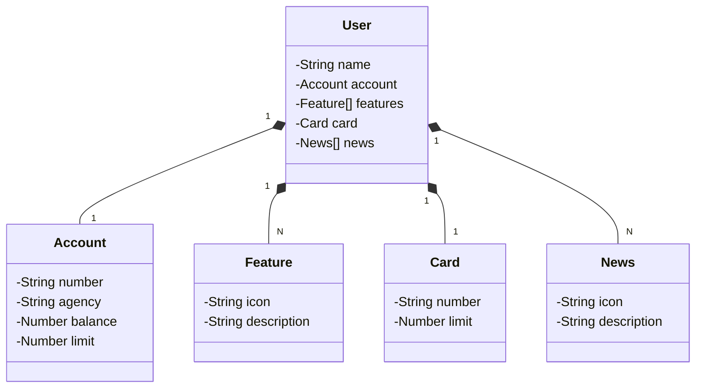

```md
# 🚀 Santander Dev Week 2023 - API RESTful em Java

Este projeto é uma **API RESTful** desenvolvida durante o evento **Santander Dev Week 2023**, utilizando as mais recentes tecnologias do ecossistema Java. O objetivo principal é fornecer um backend estruturado para uma aplicação bancária, garantindo boas práticas de desenvolvimento, escalabilidade e documentação robusta.

## 🛠️ Tecnologias Utilizadas

✅ **Java 17** → Versão LTS mais recente, com melhorias de desempenho e segurança.  
✅ **Spring Boot 3** → Framework que maximiza a produtividade através de auto-configuração.  
✅ **Spring Data JPA** → Facilita a integração com bancos de dados SQL e abstrai a camada de persistência.  
✅ **OpenAPI (Swagger)** → Documentação detalhada e interativa para os endpoints da API.  
✅ **Railway** → Plataforma para deploy na nuvem, facilitando a hospedagem e o monitoramento da aplicação.  

## 🎨 [Figma - Modelagem do Domínio](https://www.figma.com/file/0ZsjwjsYlYd3timxqMWlbj/SANTANDER---Projeto-Web%2FMobile?type=design&node-id=1421%3A432&mode=design&t=6dPQuerScEQH0zAn-1)

O **Figma** foi utilizado para abstrair o domínio da API, facilitando a análise e o design da solução.

## 🏗️ Diagrama de Classes



## 📌 Como Executar o Projeto

### Pré-requisitos
- **Java 17+** instalado  
- **Maven** para gerenciamento de dependências  
- **Docker** (opcional, caso deseje rodar o banco de dados em container)  

### Passos

1. Clone o repositório:
   ```sh
   git clone https://github.com/seu-usuario/santander-dev-week-2023.git
   ```
2. Acesse o diretório do projeto:
   ```sh
   cd santander-dev-week-2023
   ```
3. Compile e execute o projeto com Maven:
   ```sh
   mvn spring-boot:run
   ```
4. Acesse a documentação da API no navegador:
   ```
   http://localhost:8080/swagger-ui.html
   ```

## 🔗 Links Úteis

- 📂 [Repositório Oficial - Código Desenvolvido no Evento](https://github.com/falvojr/santander-dev-week-2023)  
- 🚀 [Versão Mais Robusta com Melhorias e CRUD Completo](https://github.com/digitalinnovationone/santander-dev-week-2023-api)  

## 📜 Licença

Este projeto foi desenvolvido para fins educacionais e está aberto para estudo e aprimoramento.  

```