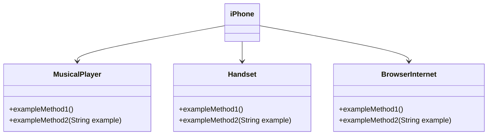

## OOP - Desafio

### Modelagem e Diagramando um Componente do iPhone

Neste desafio, você será responsável por modelar e diagramar a representação UML do componente do iPhone, cobrindo suas funcionalidades como um Reprodutor de Música, Aparelho Telefônico e Navegador de Internet.

#### Contexto
Com base no vídeo de lançamento do iPhone de 2007 (link abaixo), você deve diagramar as classes e interfaces usando uma ferramenta UML de sua escolha. Em seguida, implemente as classes e interfaces no formato de arquivo `.java`.

[Lançamento do iPhone 2007](https://www.youtube.com/watch?v=9ou608QQRq8)
- Minutos relevantes: 00:15 a 00:55

#### Funcionalidades para Modelar
1. **Reprodutor de Música**
    - Métodos: `play()`, `pause()`, `selectMusic(String music)`
2. **Aparelho Telefônico**
    - Métodos: `call(String number)`, `answer()`, `startVoiceCall()`
3. **Navegador de Internet**
    - Métodos: `displayPage(String url)`, `addNewTab()`, `updatePage()`

### Objetivo
1. Crie um diagrama UML que represente as funcionalidades descritas acima.
2. Implemente as classes e interfaces correspondentes em Java (Opcional).
3. 
### Exemplo de Diagrama UML (Mermaid)


### Instruções
1. Assista ao vídeo de lançamento do iPhone para entender as principais funcionalidades.
2. Use uma ferramenta UML de sua escolha para criar o diagrama das classes e interfaces. Você pode usar o modelo acima (criado na sintaxe [Mermaid](https://mermaid.js.org/)), uma alternativa de código aberto e compatível com arquivos Markdown como este.
3. Opcionalmente, se você estiver cheio de confiança, pode implementar as classes Java representadas no seu diagrama UML.
4. Envie seu repositório GitHub de acordo com as diretrizes da plataforma DIO. Por exemplo:

```bash
https://github.com/glysns/trilha-java-basico/desafios/poo/README.md
````
