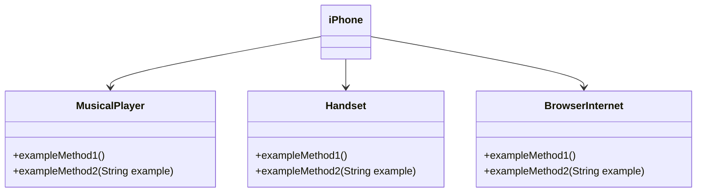

# [DIO](www.dio.me) - Basic Java Track

## Authors
- [Gleyson Sampaio](https://github.com/glysns)

## OOP - Challenge

### Modeling and Diagramming an iPhone Component

In this challenge, you will be responsible for modeling and diagramming the UML representation of the iPhone component, covering its functionalities as a Music Player, Telephone Handset and Internet Browser.

#### Context
Based on the iPhone launch video from 2007 (link below), you should diagram the classes and interfaces using a UML tool of your choice. Then implement the classes and interfaces in `.java` file format.

[iPhone 2007 release](https://www.youtube.com/watch?v=9ou608QQRq8)
- Relevant minutes: 00:15 to 00:55

#### Features to Model
1. **Music Player
    - Methods: `play()`, `pause()`, `selectMusic(String music)`
2. **Handset**
    - Methods: `call(String number)`, `answer()`, `startVoiceCall()`
3. **Internet Browser**
    - Methods: `displayPage(String url)`, `addNewTab()`, `updatePage()`

### Objective
1. Create a UML diagram that represents the functionalities described above.
2. Implement the corresponding classes and interfaces in Java (Optional).
3. 
### UML Diagram Example (Mermaid)


### Instructions
1. Watch the iPhone launch video to understand the main features.
2. Use a UML tool of your choice to create the diagram of the classes and interfaces. You can use the template above (created in [Mermaid](https://mermaid.js.org/) syntax), an open-source alternative and compatible with Markdown files like this one.
3. Optionally, if you're full of confidence, you can implement the Java classes represented in your UML diagram.
4. Submit your GitHub repository according to the DIO platform guidelines. For example:

```bash
https://github.com/glysns/trilha-java-basico/desafios/poo/README.md
```` 
